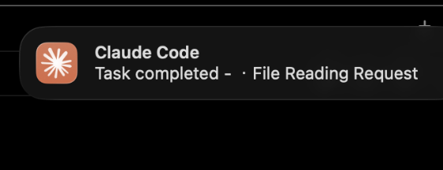

# Claude Code Notify

Native macOS notifications for [Claude Code](https://github.com/anthropics/claude-code) CLI.

Get notified when Claude completes a task or needs your input - with support for Warp terminal tab names!



## Features

- Native macOS notifications (no dependencies)
- Shows which Warp tab the notification came from
- Smart notification suppression when terminal is focused
- Customizable sounds
- Works with multiple terminals (Warp, iTerm2, Terminal.app, VS Code, etc.)
- One-line installation with automatic configuration

## Requirements

- macOS 12.0 or later
- Xcode Command Line Tools (`xcode-select --install`)
- Claude Code CLI

## Installation

**One-line install** (recommended):

```bash
curl -fsSL https://raw.githubusercontent.com/suatkocar/claude-code-notify/main/install.sh | bash
```

This will:
1. Download and compile the notification app
2. Configure hooks in `~/.claude/settings.json` automatically
3. Request notification permission

**Manual install**:

```bash
git clone https://github.com/suatkocar/claude-code-notify.git
cd claude-code-notify
./install.sh
```

## Configuration

Add the following to your `~/.claude/settings.json`:

```json
{
  "hooks": {
    "Stop": [
      {
        "matcher": "",
        "hooks": [
          {
            "type": "command",
            "command": "~/.claude/notify.sh 'Claude Code' 'Task completed' 'Glass' \"$TERM_PROGRAM\""
          }
        ]
      }
    ],
    "Notification": [
      {
        "matcher": "permission_prompt",
        "hooks": [
          {
            "type": "command",
            "command": "~/.claude/notify.sh 'Claude Code' 'Waiting for your input' 'Glass' \"$TERM_PROGRAM\""
          }
        ]
      }
    ]
  }
}
```

## How It Works

1. **Stop Hook**: Triggers when Claude finishes a response
2. **Notification Hook**: Triggers when Claude needs permission to run a command

The notification includes:
- Title: "Claude Code"
- Message: Task status + Warp tab name (if using Warp)
- Sound: Customizable (default: Glass)

### Smart Features

- **Tab Name Detection**: When using Warp, shows which tab the notification came from
- **Focus Detection**: Skips notification if you're already looking at the terminal
- **No Background Process**: App only runs when sending a notification, then exits

## Customization

### Change Notification Sound

Available sounds: `Basso`, `Blow`, `Bottle`, `Frog`, `Funk`, `Glass`, `Hero`, `Morse`, `Ping`, `Pop`, `Purr`, `Sosumi`, `Submarine`, `Tink`

```bash
~/.claude/notify.sh 'Claude Code' 'Task completed' 'Ping' "$TERM_PROGRAM"
```

### Supported Terminals

| Terminal | TERM_PROGRAM |
|----------|--------------|
| Warp | WarpTerminal |
| Terminal.app | Apple_Terminal |
| iTerm2 | iTerm.app |
| VS Code | vscode |
| Alacritty | alacritty |
| Kitty | kitty |
| Hyper | Hyper |

## Troubleshooting

### Notifications not showing?

1. Check System Settings > Notifications > Claude Code
2. Make sure "Allow Notifications" is enabled
3. Set alert style to "Banners" or "Alerts"

### Permission denied?

```bash
chmod +x ~/.claude/notify.sh
codesign --force --deep --sign - ~/.claude/ClaudeNotify.app
```

## Uninstall

```bash
rm -rf ~/.claude/ClaudeNotify.app
rm ~/.claude/notify.sh
```

Remove the hooks from `~/.claude/settings.json`.

## License

MIT
