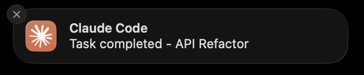
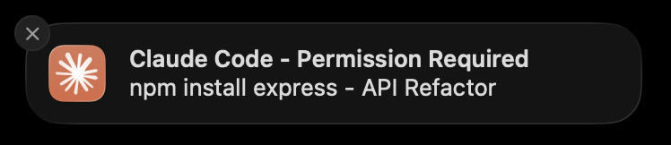

# Claude Code Notify

Native macOS notifications for [Claude Code](https://github.com/anthropics/claude-code) CLI.

Get notified when Claude completes a task or needs your permission - instantly!

| Task Completed | Permission Required |
|:-:|:-:|
|  |  |

## Features

- **Instant notifications** - No delay thanks to PreToolUse hook
- **Smart permission detection** - Only notifies when permission is actually needed
- **Native macOS notifications** - No dependencies
- **Warp tab name support** - Shows which tab the notification came from
- **Customizable sounds**
- **Works with all terminals** (Warp, iTerm2, Terminal.app, VS Code, etc.)
- **One-line installation** with automatic configuration

## Requirements

- macOS 12.0 or later
- Xcode Command Line Tools (`xcode-select --install`)
- Claude Code CLI

## Installation

**One-line install** (recommended):

```bash
curl -fsSL https://raw.githubusercontent.com/suatkocar/claude-code-notify/main/install.sh | bash
```

This will:
1. Download and compile the notification app
2. Configure hooks in `~/.claude/settings.json` automatically
3. Request notification permission

**Manual install**:

```bash
git clone https://github.com/suatkocar/claude-code-notify.git
cd claude-code-notify
./install.sh
```

## Configuration

The installer automatically adds these hooks to `~/.claude/settings.json`:

```json
{
  "hooks": {
    "Stop": [
      {
        "matcher": "",
        "hooks": [
          {
            "type": "command",
            "command": "~/.claude/notify.sh 'Claude Code' 'Task completed' 'Glass'"
          }
        ]
      }
    ],
    "PreToolUse": [
      {
        "matcher": "Bash|Write|Edit",
        "hooks": [
          {
            "type": "command",
            "command": "~/.claude/notify-permission.sh"
          }
        ]
      }
    ]
  }
}
```

## How It Works

1. **Stop Hook**: Notifies when Claude finishes a response
2. **PreToolUse Hook**: Notifies when Claude needs permission to run a command

### Smart Permission Detection

The `notify-permission.sh` script reads your `permissions.allow` list from `settings.json` and only sends notifications when:
- The tool actually requires permission (not in your allowed list)
- Shows the command/file path in the notification

**Notification content:**
- Bash commands: Shows the command (e.g., `Permission Required: npm install`)
- Edit/Write: Shows the file path (e.g., `Permission Required: Edit: /path/to/file.js`)

## Customization

### Change Notification Sound

Available sounds: `Basso`, `Blow`, `Bottle`, `Frog`, `Funk`, `Glass`, `Hero`, `Morse`, `Ping`, `Pop`, `Purr`, `Sosumi`, `Submarine`, `Tink`

Edit the hooks in `~/.claude/settings.json` to change the sound.

## Troubleshooting

### Notifications not showing?

1. Check System Settings > Notifications > Claude Code
2. Make sure "Allow Notifications" is enabled
3. Set alert style to "Banners" or "Alerts"

### Permission denied?

```bash
chmod +x ~/.claude/notify.sh
chmod +x ~/.claude/notify-permission.sh
codesign --force --deep --sign - ~/.claude/ClaudeNotify.app
```

## Uninstall

```bash
rm -rf ~/.claude/ClaudeNotify.app
rm ~/.claude/notify.sh
rm ~/.claude/notify-permission.sh
```

Remove the `Stop` and `PreToolUse` hooks from `~/.claude/settings.json`.

## License

MIT
